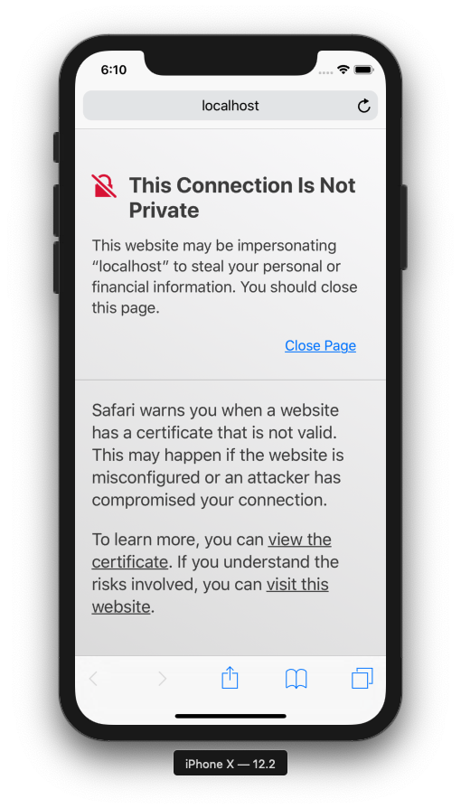

# Amazon Pay モバイル サンプルアプリ iOS(iPhone, iPad)版
下記のiOSアプリの実装です。
https://github.com/tauty/amazonpay-mobile-lite_server

## 動作環境
Apple iOS バージョン11.2以降: Safari Mobile 11以降  
[参考] https://pay.amazon.com/jp/help/202030010

### iOSアプリ向けの実装サンプル
アプリ側で商品の購入数を選んで受注情報を作成し、SFSafariViewを起動してAmazon Payへのログイン・住所＆支払い方法の選択を実施し、アプリ側に戻って購入を実行してから、購入完了画面を表示します。  

詳細は、[flow-ios.xlsx](./flow-ios.xlsx)の「WebView - safari決済」タブ参照。  
※ 同flowには各処理のURL, 処理するClass名、HTMLテンプレート名なども記載されているので、サンプルコードを読む時にもご参照ください。

## プロジェクトのOpenとサンプルアプリの起動
本プロジェクトは、Mac上の[Xcode](https://developer.apple.com/jp/xcode/)で開きます。そのほかの環境での開き方は、ここでは扱いません。  
※ ここではversion 10.2.1を使用しています。  

まずは、本プロジェクトをcloneしてください。  
```
git clone https://github.com/tauty/amazonpay-mobile-sample_ios.git
```

次にXcodeを立ち上げます。  

「Open another project」で、cloneしたプロジェクトを選択して、「Open」  
プロジェクトが開いたら、Menuの「Product」→「Run」か、画面上部の「Run」ボタンより、applicationを起動してください。

Simulatorが立ち上がり、サンプルアプリが起動します。(1〜2分かかります。)  


## 自己証明書のインストール
今回のサンプルでは、server側のSSL証明書に自己証明書が使用されているため、サンプルアプリを正しく動作させるためにはその自己証明書をiOS側にInstallする必要があります。  
ここでは、起動したSimulatorへのInstall方法を説明します。
※ 以下はiOS12.2で実施しておりますが、iOSのバージョンによっては手順が若干違う場合があります。

1. SSL自己証明書のDownload  
Safariを立ち上げ、下記のURLにアクセスします。(Chrome等の他のブラウザだとうまくいかないことがあるので、必ずSafariをご使用ください。)  
https://localhost:8443/crt/sample.crt  
下記のように警告が出るので、「Show Details」  
  
「visit this website」のリンクをタップし、表示されたダイアログで再度「Visit Website」をタップ  
  
「Allow」をタップし、で開いたダイアログで「Close」をタップ  
  

2. SSL自己証明書のInstall  
Safariを閉じて、「Settings」 →　「General」 → 「Profile」  
今ダウンロードされた「localhost」をタップ  
  
「Install」をタップし、開いたダイアログで再度「Install」をタップ  
  
Installが完了します。  
  

3. SSL自己証明書の有効化  
「Settings」 →　「General」 → 「About」で下記を開いて、「Certificate Trust Settings」  
  
先ほどInstallした「localhost」をONにし、表示されたダイアログで「Continue」をタップして有効化します。  
  

あとはSimulator上でサンプルアプリを立ち上げて動作をご確認ください。
